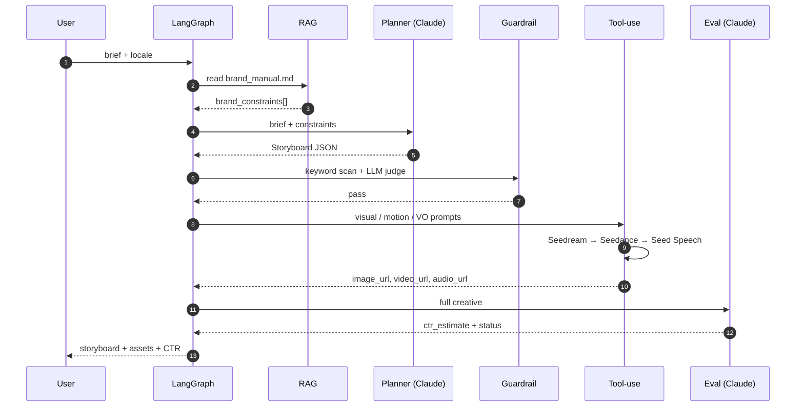

# Saudi Ad Agent — `saudi-ad-agent`

> **Brief.** A Saudi-Arabia-based e-commerce client wants an agent that
> automates the full *ad creative production → distribution → analytics*
> loop. This repo is a take-home implementation focused on the **production
> side** of that loop (the upstream half), shipped as a multi-tool LangGraph
> agent with offline-mockable LLM and image/video/TTS calls so the demo runs
> with no API keys.

---

## 1. Capabilities

| Capability | Where it lives | What it does |
| --- | --- | --- |
| **Planner** | `src/nodes/planner.py` | Breaks the customer brief into an asset script and storyboard (hook / body / CTA / visual prompt / motion prompt / Arabic voiceover). |
| **Tool-use** | `src/nodes/tool_use.py` + `src/tools/seed_apis.py` | Calls **Seedream** (image), **Seedance** (image-conditioned video), and **Seed Speech** (Arabic TTS). Mocked by default; flip `*_MOCK=0` to wire real clients. |
| **RAG** | `src/nodes/rag.py` + `data/brand_manual.md` | Loads the customer's brand manual (Markdown or PDF) and surfaces brand constraints to the planner and guardrail. |
| **Eval** | `src/nodes/eval.py` | Predicts CTR using a heuristic *and* an LLM judge, blends the two, and reruns a brand-safety self-check. Fails the run if predicted CTR < 1.5%. |
| **Guardrail** | `src/nodes/guardrail.py` | Two-layer compliance filter: deterministic AR/EN keyword blocklist (alcohol, pork, gambling, Ramadan-sensitive terms) followed by an LLM judge. Loops back to the planner up to 2 retries. |

---

## 2. Architecture

```mermaid
flowchart TD
    A([Customer brief]) --> RAG[RAG node<br/>load brand manual]
    RAG --> P[Planner node<br/>brief → storyboard JSON]
    P --> G{Guardrail<br/>AR/EN blocklist + LLM judge}
    G -- fail<br/>(retry ≤ 2x) --> P
    G -- pass --> T[Tool-use node]
    subgraph Seed APIs (mocked)
      T --> S1[Seedream<br/>image]
      S1 --> S2[Seedance<br/>video]
      T --> S3[Seed Speech<br/>Arabic VO]
    end
    S2 --> E[Eval node<br/>CTR + brand-safety self-check]
    S3 --> E
    E --> O([Storyboard + asset URLs<br/>+ CTR estimate])
```

### Sequence — happy path



### Why these nodes and not others

- **RAG separated from Planner** so swapping a markdown manual for a vector
  store later is a one-file change.
- **Guardrail before Tool-use** because Seedance calls are slow + expensive.
  Failing fast saves real money in production.
- **Eval after Tool-use** so the LLM judge can reason about the actual
  copy + visual prompt + audio script as a unit, not the brief alone.

---

## 3. Quickstart

```bash
git clone <this-repo>
cd saudi-ad-agent
python -m venv .venv && source .venv/bin/activate
pip install -r requirements.txt

# Run with no API key — everything mocks. Useful for review / CI.
python main.py

# With a real Anthropic key, the Planner / Guardrail-judge / Eval-judge
# call Claude. Seed APIs stay mocked unless you set *_MOCK=0.
cp .env.example .env
# edit .env, then:
python main.py --brief "Launch our new modest-fashion summer line for KSA."
```

Run artefacts (`run.json`, `storyboard.md`) land in `outputs/runs/<timestamp>/`.

---

## 4. Sample run (offline-mock)

```text
╭── Saudi Ad Agent · run 20260508-101145-a7c910 ─╮
│ Mode: OFFLINE-MOCK                              │
╰──────────────────────────────────────────────────╯
Storyboard
  hook            Dates that taste like home.
  body            Hand-picked Ajwa from Madinah, delivered to your door before Iftar.
  cta             Shop now
  voiceover       أهلاً بكم، تمر العجوة من المدينة، وصلكم قبل المغرب.
  voice           ar-SA-female-warm
Generated assets
  Image (Seedream)     https://mock.seedream.bytedance.com/img/…
  Video (Seedance)     https://mock.seedance.bytedance.com/vid/…
  Audio (Seed Speech)  https://mock.seedspeech.bytedance.com/tts/…
Eval
  CTR estimate: 3.20%
  Status: pass
  Guardrail: pass (revisions: 0)
```

---

## 5. Project layout

```
saudi-ad-agent/
├── main.py                  # CLI entrypoint (rich-formatted output)
├── requirements.txt
├── .env.example
├── data/
│   └── brand_manual.md      # demo brand manual ("Noor Souq")
├── docs/
│   ├── architecture.md      # extended design notes
│   └── demo_video_script.md # ≤3-min English narration with screen cues
├── src/
│   ├── state.py             # AgentState TypedDict
│   ├── llm.py               # Anthropic wrapper with offline-mock fallback
│   ├── graph.py             # LangGraph wiring
│   ├── nodes/
│   │   ├── rag.py
│   │   ├── planner.py
│   │   ├── guardrail.py
│   │   ├── tool_use.py
│   │   └── eval.py
│   └── tools/
│       └── seed_apis.py     # Seedream / Seedance / Seed Speech mock clients
├── tests/
│   └── test_smoke.py        # runs the graph end-to-end with mocks
└── outputs/
    └── runs/                # per-run JSON + storyboard markdown
```

---

## 6. Extending to the "投放 → 回流分析" half of the loop

The brief mentions the full loop including ad delivery and analytics. This
repo implements production. The natural extension points:

- **Distribution node** after `eval` — POST to Meta / Snap / TikTok Ads APIs
  with the rendered creative + bid config. Mirror the `tools/seed_apis.py`
  pattern (one client module + one node).
- **Attribution node** running on a timer — pull impressions / clicks /
  conversions, store in a DataFrame, and feed *actual* CTR back into the
  Eval node's training set so the heuristic improves over time.
- **A/B variant fan-out** — instead of one storyboard, the planner emits N
  variants, the graph fans out into parallel `tool_use → eval` branches,
  and only the top-K survive into distribution.

---

## 7. Design choices worth flagging

- **TypedDict state, not Pydantic.** Cheaper merges in LangGraph; the schema
  lives in one file (`state.py`) and is dead-simple to read.
- **Two-layer guardrail.** Cheap keyword filter short-circuits 90% of bad
  drafts; the LLM judge is only burned when needed. Saves tokens on hot path.
- **Offline-first.** Every LLM call routes through `src/llm.py`, which checks
  for `ANTHROPIC_API_KEY` and returns a deterministic mock when absent. The
  whole graph runs in CI, no secrets required.
- **Heuristic + LLM blended CTR.** Pure-LLM CTR estimates have wide variance
  run-to-run. Blending with a heuristic anchored to the brand manual's
  performance hints keeps numbers stable enough for a demo.

---

## 8. Deliverables checklist

- [x] Git repo with full source tree
- [x] README with capability matrix and quickstart
- [x] Mermaid architecture diagram + sequence diagram
- [x] Offline-runnable end-to-end demo (`python main.py`)
- [x] 3-min English demo video **script** (see `docs/demo_video_script.md`) —
      the recording is left for the submitter
- [x] Smoke test (`tests/test_smoke.py`)
