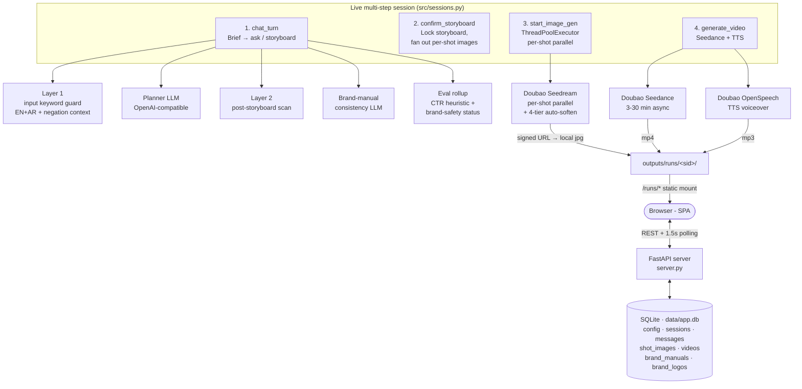
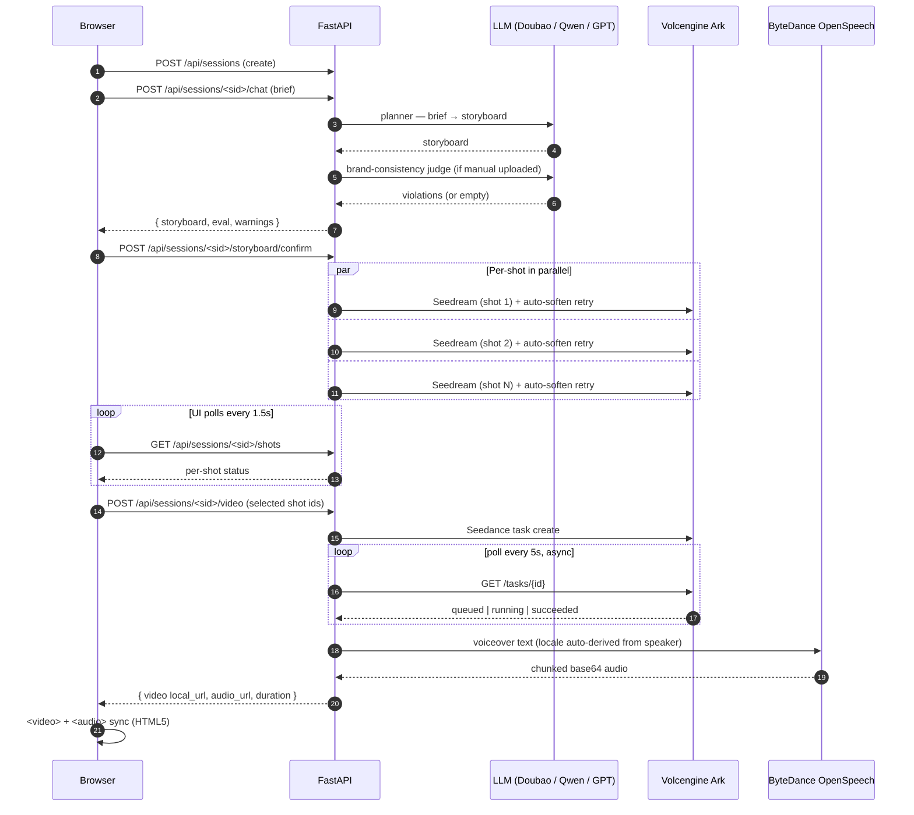

# E-commerce Advertising Generation AI Agent

> A multi-step web agent that turns a creative brief into a finished
> 9:16 short-form video ad — storyboard, stills, voiceover, all in
> one guided flow. Built on **Doubao Seedream** (image), **Doubao
> Seedance** (video), **Doubao OpenSpeech** (TTS), and an
> OpenAI-compatible LLM as the planner. Live API calls, no mocks.

The take-home brief targeted Saudi e-commerce (`saudi-ad-agent`
repo slug), but the system is locale-agnostic — Arabic / English /
Chinese voiceover, brand-manual RAG, KSA cultural guardrails on by
default.

---

## 1. Capabilities

| Capability | Where it lives | What it does |
| --- | --- | --- |
| **Multi-step web UI** | `server.py` + `web/` | FastAPI server with two pages — a four-step **Console** (`/`: Brief → Storyboard → Stills → Video) and a **Settings** page (`/settings`) for API config. Every step persists in SQLite so reload picks up where you left off. |
| **Planner** | `src/sessions.py:chat_turn` + `CHAT_SYSTEM` | Multi-turn conversation with the marketer. After each user message, the LLM either asks **one** clarifying question (`action: "ask"`) or emits a complete storyboard (`action: "storyboard"`) — hook / body / CTA / voiceover script + 3–6 shots each with scene, visual_prompt, motion_prompt, duration_s. System prompt enforces subject preservation (gender / attire) so cultural-marker softening downstream doesn't silently flip "Saudi man" to "person". |
| **Tool-use** | `src/tools/bytedance_apis.py` | Three real Volcengine clients — Seedream (sync image), Seedance (async task + poll), Doubao OpenSpeech TTS (HTTP chunked base64 streaming). Per-shot Seedream calls fan out in a `ThreadPoolExecutor` so a 5-shot storyboard renders in 5–15 s, not 25–75 s. |
| **RAG** | `src/nodes/rag.py` + `src/sessions.py:_session_brand_excerpt` | Two layers: a bundled demo brand manual (`data/brand_manual.md`) extracted into bullet-point constraints for first-time users, plus an optional user-uploaded PDF (parsed with pypdf, capped at 8 KB excerpt) that takes precedence as the authoritative source. The full manual text — not just keywords — is injected into the planner prompt so brand voice / palette / mandatories propagate verbatim. |
| **Brand-consistency check** | `src/sessions.py:_check_brand_consistency` | Second LLM pass after planner: judges the draft storyboard against the uploaded manual and returns `{rule, issue}` violations. Surfaces in the UI as a yellow "consistency warnings" banner. Fixup loop re-runs the planner once with the violation list as context. |
| **Eval (CTR + brand-safety)** | `src/sessions.py:_evaluate_storyboard_live` + `src/nodes/eval.py:_heuristic_score` | Heuristic CTR estimate (hook ≤ 8 words +1 pp, short CTA +0.5 pp, Arabic VO +0.4 pp, body > 180 chars −0.4 pp, baseline 2.5%) clamped to [0.5%, 10%]. `eval_status` rolls up CTR threshold + residual brand-safety violations into a single pass/fail pill. Heuristic-only in the live flow (no extra LLM cost per chat turn); legacy LangGraph path also blends in an LLM judge. |
| **Guardrail (3 layers)** | `src/guard.py` + `src/nodes/guardrail.py` + Seedream / Seedance auto-soften | **Layer 1 — input guard** (pre-LLM): EN + AR keyword scan with negation-context detection (`"No intimate contact"` is allowed; `"intimate scenes"` is rejected). **Layer 2 — post-storyboard scan**: same blocklist applied to LLM output, fixup loop on violation. **Layer 3 — Doubao moderation auto-soften**: per-shot 4-tier escalation (LIGHT LLM rewrite → AGGRESSIVE LLM → deterministic regex strip → product-aware NUCLEAR template) so users almost never see "rejected as sensitive" failure states. |
| **Brand logo (sign-off only)** | `src/sessions.py:_is_sign_off_shot` + `_composite_logo_onto_image` | If the user uploads a brand logo, it composites onto **only the last shot** of the storyboard (sign-off frame), not every still. Apple / Nike short-form ads resolve their brand mark once at the end — every-frame logo is the 90s-TV-ad look. |
| **Voiceover, synced** | `src/sessions.py:_gen_video` + `web/app.js:wireVoiceoverSync` | After Seedance returns a silent video, we call OpenSpeech TTS on the storyboard's `voiceover` text (locale auto-derived from speaker prefix) and save under `outputs/runs/<sid>/voice.mp3`. The video panel renders `<video>` + `<audio>` and syncs play / pause / seek / volume in JS — browser-level merge, no server-side ffmpeg required. |
| **Per-shot refine + retry** | `src/sessions.py:refine_shot`, `retry_shot` | Each Stills card has an Apply box (cumulative LLM rewrite — turn N's edit stacks on turn N-1's prompt) and a Retry button (escalates the auto-softening level and bypasses cached failures). Brand-consistency LLM judge state survives the retry. |

---

## 2. Architecture



### Session state machine

```
chat → storyboard_draft → storyboard_confirmed
                           ↓
                     images_running → images_done → video_running → video_done
```

Each transition is an explicit API call (see endpoints below). The
state lives on the session row in SQLite and gates which actions the
UI offers — e.g. you can't start image gen until a storyboard is
confirmed; you can't generate video until at least one shot succeeded.

### Sequence — happy path



---

## 3. Quickstart

```bash
git clone https://github.com/<your-user>/saudi-ad-agent
cd saudi-ad-agent

# Windows
python -m venv .venv
.venv\Scripts\activate
pip install -r requirements.txt

# macOS / Linux
python3 -m venv .venv && source .venv/bin/activate
pip install -r requirements.txt

# Start the server
python -m uvicorn server:app --host 127.0.0.1 --port 8000
```

1. Open <http://127.0.0.1:8000/settings> and paste your three keys (LLM
   + Ark + TTS). The Quick-fill chips set Base URL + Model in one click
   for Qwen / Doubao / OpenAI.
2. Open <http://127.0.0.1:8000/>, click **Load 'HYDRA bottle' sample**,
   then **Send**.
3. Wait ~3 s for the storyboard. Click **Confirm and generate stills**.
4. Wait ~10–15 s for 4–5 stills (parallel). Tick the ones you want.
5. Click **Generate video from selection**. Wait 3–5 min for the video
   + voiceover to render. Press play; voiceover syncs.

---

## 4. Configuration

Two pages, two responsibilities:

- **`/`** (Console) — multi-step flow (Brief → Storyboard → Stills →
  Video). Doesn't show any keys; reads `/api/config/status` to gate
  the Settings link's red dot indicator.
- **`/settings`** (Settings) — three sections (LLM / Ark / TTS) with
  every model knob the agent can take. Save button writes via
  `POST /api/config`; load via `GET /api/config`.

Persistence: `data/app.db` (SQLite, gitignored). The session handlers
load config from SQLite and splat it into a per-request contextvar
(`src/runtime.py`) that `src/llm.py` and `src/tools/bytedance_apis.py`
read — graph nodes never take credentials as parameters.

| Settings section | Required | Optional knobs |
| --- | --- | --- |
| **LLM (OpenAI-compatible)** | `openai_api_key` | `openai_base_url`, `openai_model`. Quick-fill chips for **Qwen** (`https://dashscope.aliyuncs.com/compatible-mode/v1`, `qwen-plus`), **Doubao** (`https://ark.cn-beijing.volces.com/api/v3`, `doubao-1-5-pro-32k`), **OpenAI** (`https://api.openai.com/v1`, `gpt-4o-mini`) |
| **Image + Video (Volcengine Ark · Doubao)** | `ark_api_key` | `ark_base_url`, `image_model` (default `doubao-seedream-5-0-260128`), `image_size`, `video_model` (default `doubao-seedance-2-0-260128`), `video_ratio`, `video_duration` |
| **Voiceover (ByteDance OpenSpeech · Doubao TTS)** | `tts_api_key` | `tts_url`, `tts_resource_id` (`seed-tts-2.0` / `seed-icl-2.0` voice cloning / …), `tts_speaker` (locale auto-derived from prefix: `en_*` → `en-US`, `zh_*` → `zh-CN`, etc.). **Advanced** (collapsed): speech_rate, loudness, emotion + scale, silence_duration. |

The Settings link in the top nav shows a small red dot only when keys
are missing (Apple-style: silent steady-state, surface only when
attention is needed). The Send button is gated on having all three
required keys configured.

---

## 5. Sample run

```text
SESSION 7c4f2a3e9b8d                              Brand-safety  pass
state: video_done                                 Predicted CTR  3.6%

CAMPAIGN: HYDRA Q1 Launch
─────────────────────────────────────────────────────────────────
Hook       Cold for 24, hot for 12
CTA        Shop now
Voiceover  HYDRA. Cold for 24 hours, hot for 12 — your one bottle for everywhere.

Storyboard (5 shots, 14.5s total)
  #1  3.0s  Wide hero — matte-black bottle on light-grey surface, slow rotate
  #2  2.5s  Cap mechanism close-up
  #3  3.0s  Cold pour — condensation droplets, blue tint
  #4  3.5s  Hot pour — steam, warm tint
  #5  2.5s  SIGN-OFF — bottle + brand logo locked bottom-right

Stills (Seedream)
  #1  succeeded (3.8s)         no softening
  #2  succeeded (4.1s)         no softening
  #3  succeeded (3.5s)         no softening
  #4  succeeded (5.2s)         level-1 LIGHT softening (steam triggered hot category)
  #5  succeeded (3.9s)         no softening                  + brand logo composite

Video (Seedance)        succeeded after 4m 12s
Voiceover (TTS)         succeeded — saved at /runs/7c4f2a3e9b8d/voice.mp3

Eval rollup
  Hook is 6 words (≤8) → +1.0pp
  Short, clear CTA → +0.5pp
  Body length 14 chars — fine
  Baseline 2.5% + adjustments = 4.0% heuristic CTR
  Brand-safety pass — no residual violations
  → eval_status: pass
```

---

## 6. Project layout

```
saudi-ad-agent/
├── server.py                 # FastAPI app — pages (/ + /settings) + 27 API routes
├── main.py                   # CLI entrypoint (uses legacy LangGraph path)
├── requirements.txt
├── .env.example
├── data/
│   ├── brand_manual.md       # Demo brand manual ("Noor Souq")
│   └── app.db                # SQLite settings + sessions store (gitignored)
├── docs/
│   ├── architecture.md       # State machine + per-request contextvar + retry tiers
│   ├── demo_video_script.md  # ≤3-min English demo narration with screen cues
│   ├── usage_manual.md
│   └── test_report.md
├── src/
│   ├── sessions.py           # Live multi-step flow — the heart of the system
│   ├── runtime.py            # Per-request config contextvar
│   ├── storage.py            # SQLite — sessions / messages / shots / videos / config
│   ├── guard.py              # Input keyword guard (EN+AR + negation context)
│   ├── llm.py                # OpenAI-compatible wrapper (also accepts Anthropic key)
│   ├── state.py              # Legacy LangGraph TypedDict
│   ├── graph.py              # Legacy LangGraph wiring (used by main.py / /api/run)
│   ├── nodes/                # Reusable building blocks
│   │   ├── rag.py            # Brand manual extractor
│   │   ├── planner.py        # Locale-aware voiceover language picker
│   │   ├── guardrail.py      # Post-storyboard keyword check
│   │   ├── tool_use.py       # _soften_prompt with 4 tiers (LIGHT/AGGRESSIVE/STRIP/NUCLEAR)
│   │   └── eval.py           # CTR heuristic + LLM judge (live flow uses heuristic only)
│   └── tools/
│       └── bytedance_apis.py # Real Doubao clients: Seedream / Seedance / OpenSpeech TTS
├── web/
│   ├── index.html            # Console — 4-step stepper + chat compose + storyboard + stills + video
│   ├── settings.html         # Settings — 3 sections, advanced collapse
│   ├── styles.css            # Apple-style hairline dividers, calm states
│   ├── app.js                # Console logic — per-tab session, polling, voiceover sync
│   └── settings.js           # Settings logic — quick-fill chips, advanced disclosure
├── tests/
│   └── test_smoke.py
└── outputs/
    └── runs/<sid>/           # shots/<id>.jpg + video.mp4 + voice.mp3 (gitignored)
```

---

## 7. Design choices worth flagging

- **Server-side settings persistence in SQLite**. Run page never sees
  keys; Settings page is the only place keys appear in the DOM. Per-tab
  session id in `sessionStorage` so `+ New session` opens a clean tab
  without losing the original.
- **Per-request `contextvars` for credentials** ([src/runtime.py](src/runtime.py)).
  Concurrent worker threads with different keys never cross-contaminate.
- **4-tier auto-soften retry on Doubao moderation** — when Seedream /
  Seedance reject as sensitive, the agent escalates progressively:
    1. **LIGHT** — LLM cultural-marker rewrite ("Saudi mother in abaya"
       → "young woman in modest long-sleeve top"). Preserves gender
       explicitly so beauty-category bias doesn't flip subjects.
    2. **AGGRESSIVE** — LLM drops cultural markers but keeps gender +
       action.
    3. **STRIP** — deterministic regex replacement (`Saudi man` → `man`,
       `thobe` → `modern casual outfit`, `halos` → `mist trails`). No
       LLM call — fast, predictable.
    4. **NUCLEAR** — product-aware safe template that extracts the
       product noun (perfume / oud / dates / coffee / watch / …) from
       the original and emits "A clean modern close-up product shot
       of a [product] …". Almost always passes.
  All five attempts (original + 4 tiers) run automatically per shot
  before the user ever sees a failure.
- **Negation-aware input guard** ([src/guard.py](src/guard.py)). User
  typing `"No intimate physical contact; women shall not show their
  hair"` (a constraint declaration) used to be wholesale-rejected
  because "intimate" is on the blocklist. Fixed by scanning for
  negation tokens (no, not, never, without, avoid, exclude, prevent,
  shouldn't, isn't, ...) within 80 chars before the hit. Hard-bans
  (alcohol/pork/gambling) and Muslim-sensitive (intimate/dating/...)
  both honour negation.
- **Voiceover via browser-level audio + video sync**, not server-side
  ffmpeg merge. Seedance renders silent video; we keep audio in a
  separate `<audio>` tag and sync play / pause / seek / volume to the
  `<video>` element. Simpler to ship; no ffmpeg dependency.
- **Brand logo only on sign-off frame**. Per-shot logo overlay would
  look like a 90s-TV ad — Apple / Nike resolve their brand mark once
  at the end. `_is_sign_off_shot(session_id, shot_id)` returns true
  only for the last shot in the storyboard; the planner is told to
  reserve a clean bottom-right empty area on that shot, and the user's
  uploaded logo is alpha-composited there.
- **TypedDict state, not Pydantic.** Cheap merges in LangGraph; the
  schema lives in one file ([src/state.py](src/state.py)). Live flow
  uses plain dicts via SQLite — even simpler.
- **Two parallel architectures**: the live multi-step flow (the demo)
  and the legacy LangGraph one-shot path (used by `main.py` and the
  preserved `/api/run` endpoint). They share the same nodes (rag,
  planner, guardrail, eval) so the LangGraph route still works for
  scripted batch runs while the UI uses the multi-step flow.

---

## 8. Extending to the "投放 → 回流分析" half of the loop

The brief mentioned the full loop including ad delivery and analytics.
This repo implements **production**. The natural extension points:

- **Distribution step** after `video_done` — POST to Meta / Snap /
  TikTok Ads APIs with the rendered creative + bid config. Mirror the
  `tools/bytedance_apis.py` pattern (one client module + one method on
  `sessions.py`).
- **Attribution step** running on a timer — pull impressions / clicks
  / conversions, store in SQLite alongside the run, feed *actual* CTR
  back into the Eval node's heuristic so the predictor improves over
  time.
- **A/B variant fan-out** — instead of one storyboard, the planner
  emits N variants; sessions.py fans out into parallel video gens, and
  only the top-K survive into distribution.

---

## 9. Deliverables checklist

- [x] Git repo with full source tree (this repo)
- [x] README with capability matrix and quickstart (this file)
- [x] Architecture diagrams — flowchart + sequence (Mermaid above; full
      walkthrough in [docs/architecture.md](docs/architecture.md))
- [x] Multi-step web UI with full configurability
- [x] Real ByteDance / Volcengine integrations (Seedream / Seedance / TTS)
- [x] Auto-retry on safety-filter rejections (4 tiers), graceful
      degradation on hard failures
- [x] 3-min English demo video **script** (see [docs/demo_video_script.md](docs/demo_video_script.md))
- [x] Smoke test ([tests/test_smoke.py](tests/test_smoke.py))
