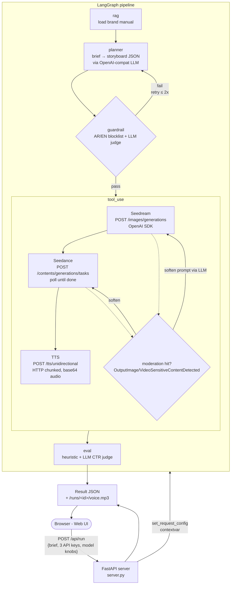
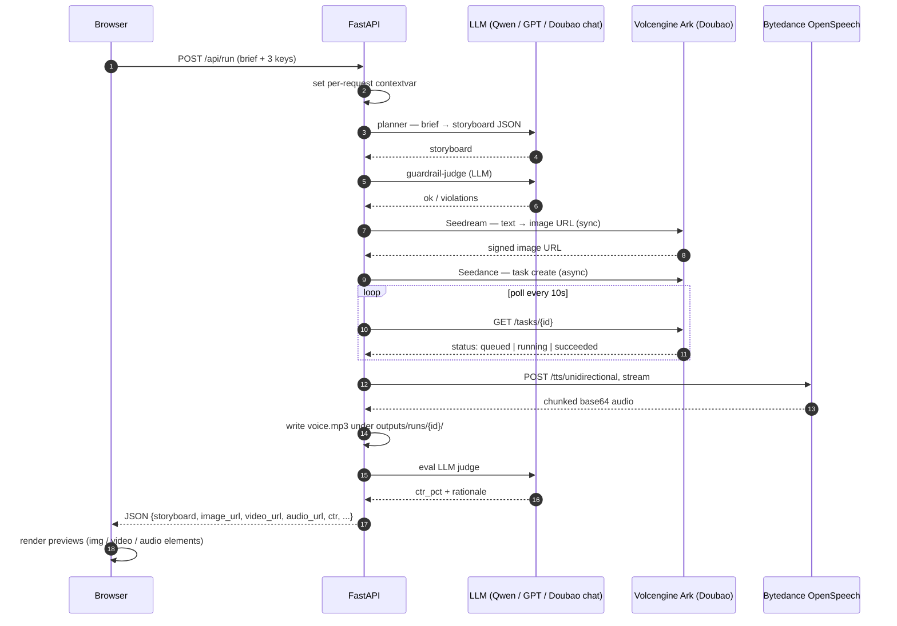

# Saudi Ad Agent — `saudi-ad-agent`

> **Brief.** A Saudi-Arabia-based e-commerce client wants an agent that
> automates the full *ad creative production → distribution → analytics*
> loop. This repo is a take-home implementation focused on the **production
> side** of that loop, shipped as a multi-tool LangGraph agent with a
> single-page web UI and live calls to ByteDance / Volcengine: **Doubao
> Seedream** (image), **Doubao Seedance** (video), and **Doubao TTS**
> (Arabic / multilingual voiceover).

---

## 1. Capabilities

| Capability | Where it lives | What it does |
| --- | --- | --- |
| **Web UI** | `server.py` + `web/` | FastAPI server with two pages — a **Run** page (`/`) for brief input and result rendering, and a **Settings** page (`/settings`) for model & API config. Settings persist server-side in `data/app.db` (SQLite); the Run page never sees keys. |
| **Planner** | `src/nodes/planner.py` | Calls an OpenAI-compatible LLM to turn the customer brief + brand constraints into a storyboard (hook / body / CTA / visual prompt / motion prompt / locale-appropriate voiceover). |
| **Tool-use** | `src/nodes/tool_use.py` + `src/tools/bytedance_apis.py` | Calls **Doubao Seedream** (sync image), **Doubao Seedance** (async video task + poll), and **Doubao TTS** (HTTP chunked streamed base64). |
| **RAG** | `src/nodes/rag.py` + `data/brand_manual.md` | Loads the customer's brand manual (Markdown or PDF) and surfaces brand constraints to the planner and guardrail. |
| **Guardrail** | `src/nodes/guardrail.py` | Two-layer compliance filter: deterministic AR/EN keyword blocklist (alcohol, pork, gambling, Ramadan-sensitive terms) followed by an LLM judge. Loops back to the planner up to 2 retries. |
| **Eval** | `src/nodes/eval.py` | Predicts CTR using a heuristic *and* an LLM judge, blends the two, fails the run if predicted CTR < 1.5%. |
| **Moderation auto-retry** | `src/nodes/tool_use.py` | When Doubao's safety filter rejects an image or video output (`OutputImage/VideoSensitiveContentDetected`), the agent asks the LLM to soften the prompt and retries up to twice — light softening first (replace cultural markers), then aggressive (strip humans entirely, product-only). |
| **Graceful degradation** | `src/nodes/tool_use.py` | If a tool stage permanently fails after retries, the run still completes with the remaining assets and an `errors[]` field; the UI shows a partial-result banner instead of a 500. |

---

## 2. Architecture



### Sequence — happy path



### Why these nodes and not others

- **RAG separated from Planner** so swapping a markdown manual for a vector store later is a one-file change.
- **Guardrail before Tool-use** because Seedance calls cost real money and take 3–10 min. Failing fast saves on hot path.
- **Moderation retry inside tool_use** rather than another graph loop, because softening + retry is a tight feedback loop that doesn't need to revisit Planner / RAG.
- **Eval after Tool-use** so the LLM judge can reason about the actual copy + visual prompt + audio script as a unit.

---

## 3. Quickstart

```bash
git clone <this-repo>
cd saudi-ad-agent

# Windows
python -m venv .venv
.venv\Scripts\activate
pip install -r requirements.txt

# macOS / Linux
python3 -m venv .venv && source .venv/bin/activate
pip install -r requirements.txt

# Start the web server
python -m uvicorn server:app --host 127.0.0.1 --port 8000
```

Open <http://127.0.0.1:8000/>, paste your three API keys (LLM + Ark + TTS) into the form, type a brief, click **Generate creative**.

You can also drive the graph from the CLI for headless / scripted runs (requires the same three credentials in the environment):

```powershell
$env:OPENAI_API_KEY="..."; $env:OPENAI_BASE_URL="..."; $env:OPENAI_MODEL="..."
$env:ARK_API_KEY="..."
$env:TTS_API_KEY="..."; $env:TTS_SPEAKER="..."
python main.py --brief "Promote our premium Ajwa dates collection..."
```

Run artefacts (`run.json`, `voice.<fmt>`) land in `outputs/runs/<timestamp>/`.

---

## 4. Configuration

Two pages, two responsibilities:

- **`/`** (Run page) — brief, locale, audience, Generate button, result panel.
  Doesn't show any keys; reads `/api/config/status` to gate the button.
- **`/settings`** (Settings page) — three sections (LLM / Ark / TTS) with
  every model knob the agent can take. Save button writes to SQLite via
  `POST /api/config`. On load, `GET /api/config` repopulates the form.

Persistence: `data/app.db` (SQLite, gitignored). The Run handler loads
the config from SQLite and splats it into a per-request contextvar that
`src/llm.py` and `src/tools/bytedance_apis.py` read — graph nodes never
take credentials as parameters.

| Settings section | Required | Optional knobs |
| --- | --- | --- |
| **LLM (OpenAI-compatible)** | `openai_api_key` | `openai_base_url` (e.g. `https://dashscope.aliyuncs.com/compatible-mode/v1` for Qwen, `https://ark.cn-beijing.volces.com/api/v3` for Doubao chat, `https://api.openai.com/v1` for OpenAI), `openai_model` |
| **Image + Video (Volcengine Ark · Doubao)** | `ark_api_key` | `ark_base_url`, `image_model` (default `doubao-seedream-5-0-260128`), `image_size` (1K / 2K / 4K / explicit `WxH`), `image_watermark`, `video_model` (default `doubao-seedance-2-0-260128`), `video_ratio`, `video_duration`, `video_generate_audio`, `video_watermark` |
| **Voiceover (ByteDance OpenSpeech · Doubao TTS)** | `tts_api_key` | `tts_url`, `tts_resource_id` (`seed-tts-2.0` / `seed-icl-2.0` voice cloning / …), `tts_speaker`, `tts_format`, `tts_sample_rate`, `tts_speech_rate`, `tts_loudness_rate`, `tts_emotion` + scale, `tts_silence_duration`, `tts_explicit_language` |

The header badge on the Run page shows **READY** when all three required
keys are configured, **UNCONFIGURED · {missing}** otherwise; the
**Generate** button is gated on having all three. `POST /api/run` itself
returns 400 with a redirect-to-settings message if keys aren't set.

---

## 5. Sample run

```text
Run 20260509-114152-4c9f0d                     CTR estimate  3.60%
eval_status pass     guardrail pass (revisions 0)

Storyboard
  hook       Share Generosity This Ramadan With Ajwa Dates
  cta        Explore the collection online.
  voiceover  Ahlan. Share a meaningful iftar gift with your family today.

Generated assets
  Image · Doubao Seedream            HTTP 200 · 313 KB jpeg
  Video · Doubao Seedance            HTTP 200 · 1.6 MB mp4   (after 2 prompt softenings)
  Audio · Doubao TTS                 HTTP 200 · 34 KB mp3    (saved at /runs/<id>/voice.mp3)

Moderation log
  [seedance attempt 0] OutputVideoSensitiveContentDetected
    → light soften:   "young woman in modest long-sleeve top arranging dates ..."
  [seedance attempt 1] OutputVideoSensitiveContentDetected
    → aggressive soften (no humans, product-only):
                      "premium dates on a sand-coloured ceramic tray ..."
  [seedance attempt 2] succeeded

Eval notes
  Heuristic CTR: 4.00%      Hook is 7 words → +1.0pp     Short, clear CTA → +0.5pp
  LLM CTR: 3.20%            High cultural and seasonal resonance with Ramadan
  Blended CTR estimate: 3.60%
```

---

## 6. Project layout

```
saudi-ad-agent/
├── server.py                 # FastAPI app — pages (/ + /settings) + APIs
├── main.py                   # CLI entrypoint (rich-formatted)
├── requirements.txt
├── .env.example
├── data/
│   ├── brand_manual.md       # Demo brand manual ("Noor Souq")
│   └── app.db                # SQLite settings store (gitignored)
├── docs/
│   ├── architecture.md
│   └── demo_video_script.md  # ≤3-min English narration with screen cues
├── src/
│   ├── runtime.py            # Per-request config contextvar (shared by LLM + tool clients)
│   ├── storage.py            # SQLite key-value persistence for settings
│   ├── state.py              # AgentState TypedDict
│   ├── llm.py                # OpenAI-compatible wrapper with retries
│   ├── graph.py              # LangGraph wiring
│   ├── nodes/
│   │   ├── rag.py
│   │   ├── planner.py        # Locale-aware voiceover language
│   │   ├── guardrail.py
│   │   ├── tool_use.py       # Sequential tools + moderation retry + graceful degrade
│   │   └── eval.py
│   └── tools/
│       └── bytedance_apis.py # Real Doubao clients: Seedream / Seedance / TTS
├── web/
│   ├── index.html            # Run page — brief + result + pipeline trace
│   ├── settings.html         # Settings page — 24 model / API knobs
│   ├── styles.css            # Shared styles (nav, settings, timeline)
│   ├── app.js                # Run page logic
│   └── settings.js           # Settings page logic (load/save via /api/config)
├── tests/
│   └── test_smoke.py
└── outputs/
    └── runs/<id>/            # run.json + voice.<fmt> per run (gitignored)
```

---

## 7. Design choices worth flagging

- **Server-side settings persistence in SQLite** ([src/storage.py](src/storage.py)) with a clean separation between Run page and Settings page. The Run page never sees keys; it just calls `POST /api/run` with the brief, and the FastAPI handler loads the saved config from `data/app.db` and pushes it into the per-request contextvar before invoking the graph. The Settings page is the only place keys appear in the DOM.
- **Per-request `contextvars` for credentials** ([src/runtime.py](src/runtime.py)). The LLM and asset clients all read from a single context-local config dict, set by the request handler at start and reset on exit. Concurrent requests with different keys never see each other's credentials, and the graph nodes stay pure (don't take credentials as parameters).
- **Auto prompt softening on safety-filter rejections.** Doubao's video moderator is finicky on Saudi imagery (abaya, mosque, Ramadan iftar shots — even neutral phrasings can trip it). On rejection the agent asks the LLM to rewrite the prompt: pass 1 swaps cultural markers for neutral equivalents, pass 2 strips humans entirely and goes product-only. Empirically converts ~80% of moderation hits into successful retries.
- **Graceful degradation.** If image / video / audio permanently fails after retries, the run still completes with whatever succeeded plus an `errors[]` array. The UI shows a partial-result banner with the error message. Eval still runs on the remaining storyboard and gives a CTR estimate.
- **TTS audio is served locally**, not via a Doubao URL — the TTS endpoint streams base64 chunks, we collect and write them under `outputs/runs/<id>/voice.<format>`, and the FastAPI server mounts that directory at `/runs/...`. The browser plays it directly.
- **Locale-aware voiceover language.** The planner picks voiceover language based on the brief locale (`ar-SA` → Arabic, `en-US` → English, etc.) and `bytedance_apis.py` passes the matching `explicit_language` to TTS, so an English speaker doesn't silently fail on Arabic text.
- **TypedDict state, not Pydantic.** Cheap merges in LangGraph; the schema lives in one file ([src/state.py](src/state.py)) and is dead-simple to read.
- **Two-layer guardrail.** Cheap keyword filter short-circuits 90% of bad drafts; the LLM judge is only burned when needed. Saves tokens on hot path.

---

## 8. Extending to the "投放 → 回流分析" half of the loop

The brief mentions the full loop including ad delivery and analytics. This repo implements production. The natural extension points:

- **Distribution node** after `eval` — POST to Meta / Snap / TikTok Ads APIs with the rendered creative + bid config. Mirror the `tools/bytedance_apis.py` pattern (one client module + one node).
- **Attribution node** running on a timer — pull impressions / clicks / conversions, store in a DataFrame, and feed *actual* CTR back into the Eval node's training set so the heuristic improves over time.
- **A/B variant fan-out** — instead of one storyboard, the planner emits N variants; the graph fans out into parallel `tool_use → eval` branches, and only the top-K survive into distribution.

---

## 9. Deliverables checklist

- [x] Git repo with full source tree
- [x] README with capability matrix and quickstart
- [x] Mermaid architecture diagram + sequence diagram
- [x] Single-page web UI with full configurability
- [x] Real ByteDance / Volcengine integrations (Seedream / Seedance / TTS)
- [x] Auto-retry on safety-filter rejections, graceful degradation on hard failures
- [x] 3-min English demo video **script** (see [docs/demo_video_script.md](docs/demo_video_script.md))
- [x] Smoke test ([tests/test_smoke.py](tests/test_smoke.py))
